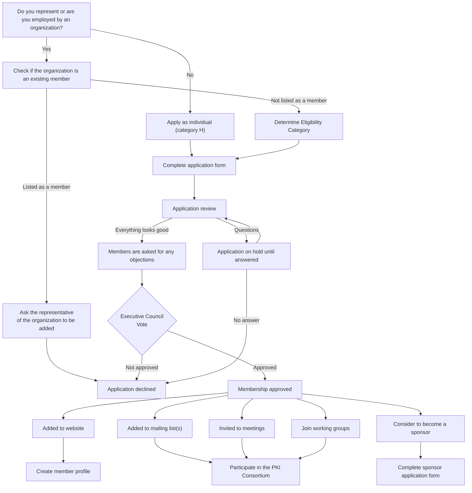

## Process for Admitting New Members

In order to admit new Members, all membership applications must agree to follow these Bylaws (including the Antitrust Policy), the PKI Consortium Code of Conduct located at https://pkic.org/code-of-conduct and the PKI Consortium Intellectual Property Rights Agreement located at https://pkic.org/ipr.

Applications must be approved by the Executive Council after feedback from the Members. Feedback and approval on a membership application by each Member and the Executive Council shall be based solely on a determination of whether or not the applicant meets the stated membership criteria, and not on any other basis including competitive considerations.

