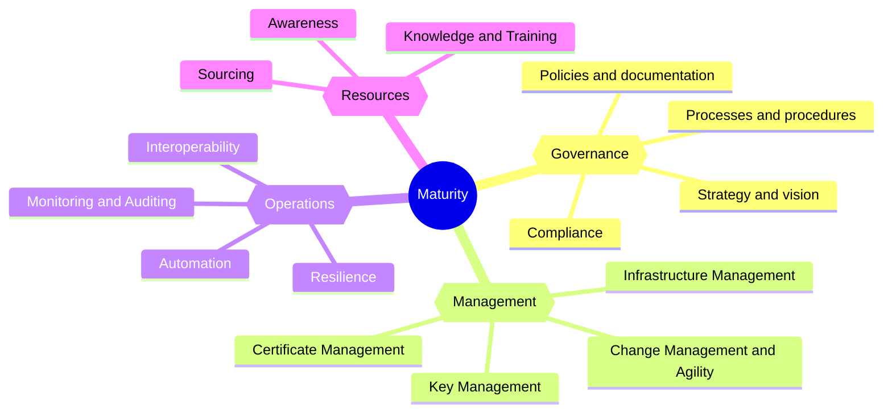

Last year, the PKI Consortium established the [PKI Maturity Model Working Group](/wg/pkimm/) to build a PKI maturity model for evaluation, planning, and comparison between different PKI implementations.

Today, we are happy to announce that the initial draft version of the model has been finalized and is publicly available!

Anyone who would like to try the model and perform the assessment is more than welcome.

## The PKI maturity model

The maturity model is based on the Capability Maturity Model Integration ([CMMI](https://en.wikipedia.org/wiki/Capability_Maturity_Model_Integration)) developed by Carnegie Mellon University. It provides the following::

- Quickly understand the current level of capabilities and performance of the PKI
- Support comparison of PKI maturity with similar organizations based on size or industry (anonymized)
- Guidance on how to improve the capabilities of the current PKI
- Improve overall PKI performance

The [PKI maturity model](https://pkic.org/pkimm/model/) defines **5** levels of the PKI maturity based on different indicators and associated risks.

| # | **Maturity level**                                                                      | **Short description**                                                                                        |
|---|-----------------------------------------------------------------------------------------|--------------------------------------------------------------------------------------------------------------|
| 1 | **[Initial](https://pkic.org/pkimm/model/maturity-levels/#initial-maturity-level)**     | Unpredictable process with poor control and always reactive                                                  |
| 2 | **[Basic](https://pkic.org/pkimm/model/maturity-levels/#basic-maturity-level)**         | Process is characterized by each particular case or project and controls are often reactive                  |
| 3 | **[Advanced](https://pkic.org/pkimm/model/maturity-levels/#advanced-maturity-level)**   | Process is characterized by organizational standards and controls are proactive                              |
| 4 | **[Managed](https://pkic.org/pkimm/model/maturity-levels/#managed-maturity-level)**     | Processes are measured and controlled, proactive approach                                                    |
| 5 | **[Optimized](https://pkic.org/pkimm/model/maturity-levels/#optimized-maturity-level)** | Continuous improvement of the processes and procedures, proactive approach for future technology improvement |

The model is divided into **4** [Modules](https://pkic.org/pkimm/model/maturity-modules/) and **15** [Categories](https://pkic.org/pkimm/model/maturity-categories) that covers aspects and activities related to the PKI (people, process, technology). The overall maturity level is determined based on the maturity of the categories.

The following diagram shows the structure of the model:

## PKI maturity assessment

The [Assessment process](https://pkic.org/pkimm/assessment/) provides a consistent and convenient approach to assess the maturity level of any PKI implementation and use case.

The assessment process defines steps to scope, assess, evaluate, and report the maturity level of the PKI implementation, including continuous improvement.

| Step | Name       | Description                                                                                                                                                                    | Reference                                                   |
|-----:|------------|--------------------------------------------------------------------------------------------------------------------------------------------------------------------------------|-------------------------------------------------------------|
|    1 | Scoping    | The scope definition is the first step of the assessment process. The scope defines the boundaries of the assessment and the applicability of the requirements.                | [Scoping](https://pkic.org/pkimm/assessment/scoping/)       |
|    2 | Assessment | The assessment is the process of evaluating the maturity of the PKI environment against the requirements defined in the maturity model within the boundaries of defined scope. | [Assessment](https://pkic.org/pkimm/assessment/assessment/) |
|    3 | Evaluation | The evaluation is the process of analyzing the results of the assessment and determining the maturity level of the PKI environment.                                            | [Evaluation](https://pkic.org/pkimm/assessment/evaluation/) |
|    4 | Reporting  | The reporting is the process of documenting the results of the assessment and evaluation.                                                                                      | [Reporting](https://pkic.org/pkimm/assessment/reporting/)   |

To support the assessment process, we have built simple Excel-based tool that guides you through the process and automatically generates evaluation and reports based on inputs provided by the assessor.

The [PKI maturity assessment tool](https://docs.google.com/spreadsheets/d/1B232VV05YGNH28kbixmI7SSd3LTuns2C/edit?usp=drive_link&ouid=102943605657406341516&rtpof=true&sd=true) is available for anyone to download and apply.

## Feedback and discussion

The PKI Consortium is planning to finalize this draft of the model and release first official version that can be used to provide consistent assessment results.
Therefore, the feedback from users is very valuable.

We have prepared [feedback form](https://forms.gle/MLsD9LT9uQZceb5r5) and would appreciate providing the information that would help us to improve and adjust the model before its final version.

Do not hesitate to use [community discussion](https://github.com/orgs/pkic/discussions/categories/pki-maturity-model-pkimm) to open any question or topic!

## Summary of resources

| Resource                                                                                                                | Description                                                                                                                                                               |
|-------------------------------------------------------------------------------------------------------------------------|---------------------------------------------------------------------------------------------------------------------------------------------------------------------------|
| [PKI maturity model](https://pkic.org/pkimm/model/)                                                                     | Definition of the PKI maturity model and description of the maturity assessment process and procedures in order to rate the current maturity level and to track progress. |
| [Categories description](https://pkic.org/pkimm/categories/)                                                            | Description of PKI maturity model related categories and associated requirement, guidance, assessment tips, and references.                                               |
| [PKI maturity assessment process](https://pkic.org/pkimm/assessment/)                                                   | Description of the assessment process.                                                                                                                                    |
| [PKI maturity assessment tools](https://pkic.org/pkimm/tools/)                                                          | Available tools for the assessment of the PKI implementation and use case.                                                                                                |
| [Feedback form](https://forms.gle/7CgvuNoxaiTYbtK29)                                                                    | PKI maturity model and assessment feedback form.                                                                                                                          |
| [PKI maturity model community discussion](https://github.com/orgs/pkic/discussions/categories/pki-maturity-model-pkimm) | Ideas, questions, or feedback that you want to share or discuss related to the PKI maturity model.                                                                        |
