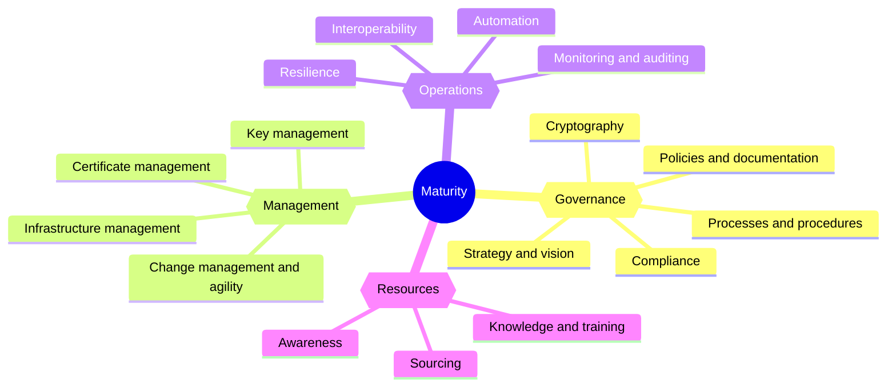

The PKI Consortium has released **version 2.0.0 of the [PKI Maturity Model (PKIMM)](/wg/pkimm/model/)**, the first new version since 1.0.0 in August 2023.

PKIMM is an open, vendor-neutral framework for evaluating, planning, and comparing PKI implementations. Any organization that operates a PKI, whatever its size, industry, or use case, can use it to see where its PKI stands today and what to improve next.

Version 2.0.0 brings the model up to date with how PKI is governed and operated today:

- A new **Cryptography** category for governing algorithms, protocols, and crypto agility
- A new requirement for **certificate validation** by the systems that rely on certificates
- **Trust anchors** in the certificate inventory, and **trust stores** in certificate discovery
- **Stable identifiers** for every category and requirement, and a shared **references catalog**
- An **extension framework** for optional criteria that target a specific risk profile or industry
- A free web **self-assessment** that now supports a full, requirement-level assessment

You can [assess your PKI against version 2.0.0](/wg/pkimm/assessment/) today, in your browser, at no cost.

## What's new in version 2.0.0

The model keeps its familiar structure: **five maturity levels** applied to **16 categories** in **four modules**, with **77 requirements** in total. The [release notes](/wg/pkimm/model/release-notes/2.0.0/) list every change; the most important ones are summarized below.

### Cryptography becomes its own category

The new [Cryptography](/wg/pkimm/model/categories/cryptography/) category in the Governance module gives cryptographic decisions a single, authoritative home. In version 1.0.0, these concerns were spread across the Key management and Certificate management categories as cipher-suite requirements, which led to overlap and ambiguous terminology. Version 2.0.0 replaces them with six requirements:

| Requirement                         | What it covers                                                                                                   |
|-------------------------------------|------------------------------------------------------------------------------------------------------------------|
| Terminology and scope               | A shared cryptographic vocabulary, used consistently across policies, standards, and procedures                  |
| Algorithms and parameters           | Approved, restricted, and prohibited algorithms and parameters, traceable to a mandated catalog where one applies |
| Protocols and versions              | Approved, deprecated, and prohibited protocols and protocol versions, with formally approved exceptions          |
| Visibility into cryptographic usage | Knowing where algorithms, keys, certificates, and protocols are used, starting with critical systems             |
| Lifecycle and deprecation           | Rules for approving, deprecating, and replacing cryptography before it becomes a risk                            |
| Cryptographic agility               | Governance and planning for a controlled response to algorithm compromise, deprecation, and regulatory change    |

With cryptographic governance in one place, Key management and Certificate management now focus on the lifecycle of keys and certificates. These requirements also lay the groundwork for a move to post-quantum cryptography.

### Certificate validation joins the model

A certificate is only as trustworthy as the checks performed by the systems that rely on it. The [Policies and documentation](/wg/pkimm/model/categories/policies-and-documentation/#validation-requirements) category adds a requirement that certificate validation rules are documented, implemented, and verified. The rules cover path construction and validation, accepted trust anchors, name constraints and key usage, policy identifiers, checking that a certificate identifies the expected subject, validity, and revocation, including what happens when revocation status cannot be determined. They can live in existing documents such as a certificate policy or an operational procedure; a separate document is not expected.

### Know which certificates and trust anchors you depend on

In [Certificate management](/wg/pkimm/model/categories/certificate-management/#cert-inventory), the inventory requirement now covers all known certificates, including the trust anchors your organization has approved, not only the certificates it issues. This makes the requirement apply to organizations that rely on certificates without issuing their own. Certificate discovery now also covers the trust stores of systems and devices, helping you find unauthorized certification authorities.

### Built for tooling and traceability

- **Level 2 is now called Foundational** instead of Basic. What the level means is unchanged; the new name better conveys its intent.
- **Stable identifiers** such as `G.strategy-and-vision.sponsor-support` replace position-based numbers such as `G.1.1`. They stay valid across minor releases, and the model now follows [semantic versioning](/wg/pkimm/model/release-notes/), so assessments, reports, and tools can reference requirements reliably over time.
- **A shared references catalog** holds the more than 60 standards, regulations, and publications the model cites. Each entry was checked against its publisher before the release, and superseded publications now point to their current versions, such as ISO/IEC 27001:2022, NIST SP 800-61 Rev. 3, and RFC 9810. See the [references catalog](/wg/pkimm/model/model/references/).

## Extensions and integrations

Version 2.0.0 introduces an [extension framework](/wg/pkimm/model/extensions/) for optional overlays that add criteria or adjust weights for a specific risk profile, technology, or industry. Extensions never change the core model or its baseline score, so your results stay comparable over time and with peers.

The first extension is the [PQC Readiness Extension](/wg/pkimm/extensions/pqc/), developed by Kennedy Nwup (Afield AB), Vice Chair of the PKIMM Working Group. It adds post-quantum readiness criteria and emphasizes the requirements most relevant to a quantum-safe transition, including those in the new Cryptography category. The extension is under development: its Governance module is complete, and the remaining modules are in progress. You can already try it by downloading its YAML definition and uploading it in the Extensions tab of the self-assessment. Your feedback now will help shape version 1.0.0 of the extension.

Integrations bring the model into the tools you already use. The [Eramba integration](/wg/pkimm/integrations/eramba/) packages PKIMM as a CSV file that you can import into the open-source Eramba GRC platform to track the requirements as controls. The [integrations page](/wg/pkimm/integrations/) lists the available packages.

## Assess your PKI in three steps

The quickest way to start is the free [PKIMM self-assessment](/wg/pkimm/assessment/). It runs entirely in your browser: there is no login, and your data stays on your device unless you choose to share it.

1. **Start in Self mode.** Rate each of the 16 categories on the five-level scale to get a first picture of your PKI maturity in minutes.
2. **Review and share your results.** See your overall and per-module maturity levels, export a PDF report, share a link with your team, or download the assessment file to keep.
3. **Go deeper in Full mode.** Answer the requirement-level questionnaire to derive each category's level. Define the scope, record evidence, plan improvements with action plans, and use the evaluation dashboard to see the gaps to the next level and compare against an earlier baseline.

## Already using version 1.0.0?

Work completed under 1.0.0 still counts: existing assessment reports remain valid. When you next reassess:

- **Add the Cryptography category** to your assessment cycle.
- **Reassess three categories.** Key management and Certificate management each lost its cipher-suite requirement, the certificate inventory now includes approved trust anchors, and Policies and documentation gained certificate validation. Recalculate these category levels, since adding or removing a weighted requirement can change a level even when no other rating changes.
- **Use the new level name.** When you reissue a report, refer to level 2 as "Foundational" instead of "Basic".
- **Migrate saved assessments.** The self-assessment offers to migrate an assessment saved under 1.0.0: matching ratings carry over, and new items are listed for you to rate.
- **Update your bookmarks.** Category pages no longer have numeric prefixes in their addresses, for example [/wg/pkimm/model/categories/strategy-and-vision/](/wg/pkimm/model/categories/strategy-and-vision/).
- **Switch from the Excel tools.** The web self-assessment replaces the Excel-based tools, which remain available with the [1.0.0 version of the model](/wg/pkimm/1.0.0/).

## Get involved

PKIMM is developed in the open by the [PKIMM Working Group](/wg/pkimm/) and published [on GitHub](https://github.com/pkic/pkimm) under the MIT license. Anyone can use it, build on it, and help improve it.

- **Assess your PKI** with the [self-assessment](/wg/pkimm/assessment/) and tell us what you think.
- **Build on the model.** Consultants, auditors, and vendors can use its YAML definition, JSON schemas, and stable identifiers in their own services and tools.
- **Join the conversation** in the [PKIMM community discussions](https://github.com/orgs/pkic/discussions/categories/pki-maturity-model-pkimm) to ask questions, suggest improvements, or propose extensions and integrations.
- **Help shape the next release** by [joining the PKI Consortium](/join/), where membership is free, and taking part in the PKIMM Working Group.

## Resources

| Resource                                                                                             | Description                                               |
|------------------------------------------------------------------------------------------------------|-----------------------------------------------------------|
| [PKI Maturity Model](/wg/pkimm/model/)                                                               | Maturity levels, modules, categories, and requirements    |
| [Release notes for 2.0.0](/wg/pkimm/model/release-notes/2.0.0/)                                      | Every change from version 1.0.0 to 2.0.0                  |
| [Self-assessment](/wg/pkimm/assessment/)                                                             | Free, browser-based assessment with Self and Full modes   |
| [Assessment methodology](/wg/pkimm/model/assessment/)                                                | How to scope, assess, evaluate, and report PKI maturity   |
| [Extensions](/wg/pkimm/extensions/)                                                                  | Optional overlays, including the PQC Readiness Extension  |
| [Integrations](/wg/pkimm/integrations/)                                                              | Packages for third-party platforms such as Eramba         |
| [FAQ](/wg/pkimm/model/faq/)                                                                          | Answers to common questions about the model               |
| [PKIMM on GitHub](https://github.com/pkic/pkimm)                                                     | Model source, YAML definition, and JSON schemas           |
| [Community discussions](https://github.com/orgs/pkic/discussions/categories/pki-maturity-model-pkimm) | Questions, ideas, and feedback                            |
