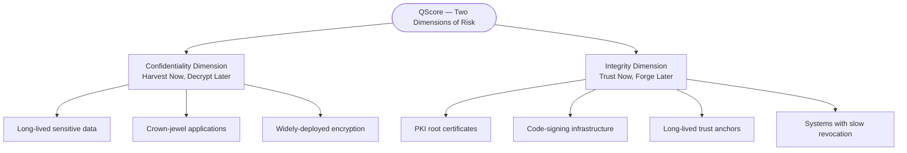

# QTrino Labs

QTrino combines applied cryptography research with enterprise security execution to help organizations transition to quantum-safe operations with measurable risk reduction and audit-ready governance.

**Built for regulated environment and long-lived confidentiality requirements.**

## Why Post Quantum Migration Stalls - The Challenge

PKI is the trust layer of the modern enterprise.Root CAs, code-signing keys, certificate chains, and revocation infrastructure — every transaction, release, and identity assertion in your organisation traces back to it.

Quantum computing does not break PKI gradually. It breaks it retrospectively, silently, and at scale.

**Two threats are already active:**

| | Threat | What It Breaks |
|---|---|---|
| `HNDL` | **Harvest Now, Decrypt Later** | Confidentiality — data collected today, decrypted when quantum capability arrives |
| `TNFL` | **Trust Now, Forge Later** | Integrity — root CAs, signing keys, and certificates forged after migration windows close |

PKI practitioners know this better than anyone.  
The question is not **whether** to migrate. It is **which root to migrate first, in what sequence, before which deadline.**

Most organisations cannot answer that question — because they have never seen their full cryptographic estate.  
Certificates across hybrid infrastructure. Keys without owners. Algorithms embedded in systems no one has inventoried. Trust anchors with no documented expiry path.

You cannot sequence what you cannot see. You cannot govern what has no owner.  
You cannot migrate on deadline without a scored, prioritised starting point.

That is three problems: **visibility, governance, and sequencing.** Most organisations have instruments for none of them.

## What QTrino Builds
**Post-quantum readiness is not an algorithm swap. It is a governance and sequencing challenge.**

***We Built QScore to Solve it***

QTrino Labs builds the measurement, visibility, governance and remediation infrastructure that regulated enterprises need to navigate PQC migration — from Quantum risk assessments, cryptographic inventory, continuous & automated posture management, to Quantum-safe hardware .

### The **QScore**
*A deterministic, per-application risk metric.*

QScore transforms post quantum cryptographic risk into board-ready numbers by treating **business applications** as the unit of risk—because that's how your business is organized.

QScore™ captures the convergent impact of two dimensions of the quantum threat:

***Current uni-dimensional risk model deprioritises your PKI root. Its confidentiality exposure is low. Its integrity QScore is critical.***  
***QScore™ flags it **P1**. A single-dimension tool buries it below line.***

**QScore is powered by CUQRM — QTrino's quantitative risk methodology.**

