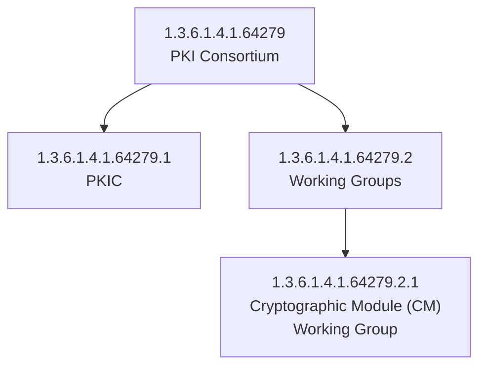

## Overview

The PKI Consortium has been assigned the Private Enterprise Number (PEN) **64279** by IANA under the arc `1.3.6.1.4.1`. This page documents all OID assignments under the PKI Consortium's arc.

## OID Tree

## Assignments

| OID | Description |
| --- | --- |
| 1.3.6.1.4.1.64279 | PKI Consortium |
| 1.3.6.1.4.1.64279.1 | PKIC |
| 1.3.6.1.4.1.64279.2 | [Working Groups](/wg/) |
| 1.3.6.1.4.1.64279.2.1 | [Cryptographic Module (CM) Working Group](/wg/cm/) |

## References

- [IANA Private Enterprise Numbers](https://www.iana.org/assignments/enterprise-numbers/)
