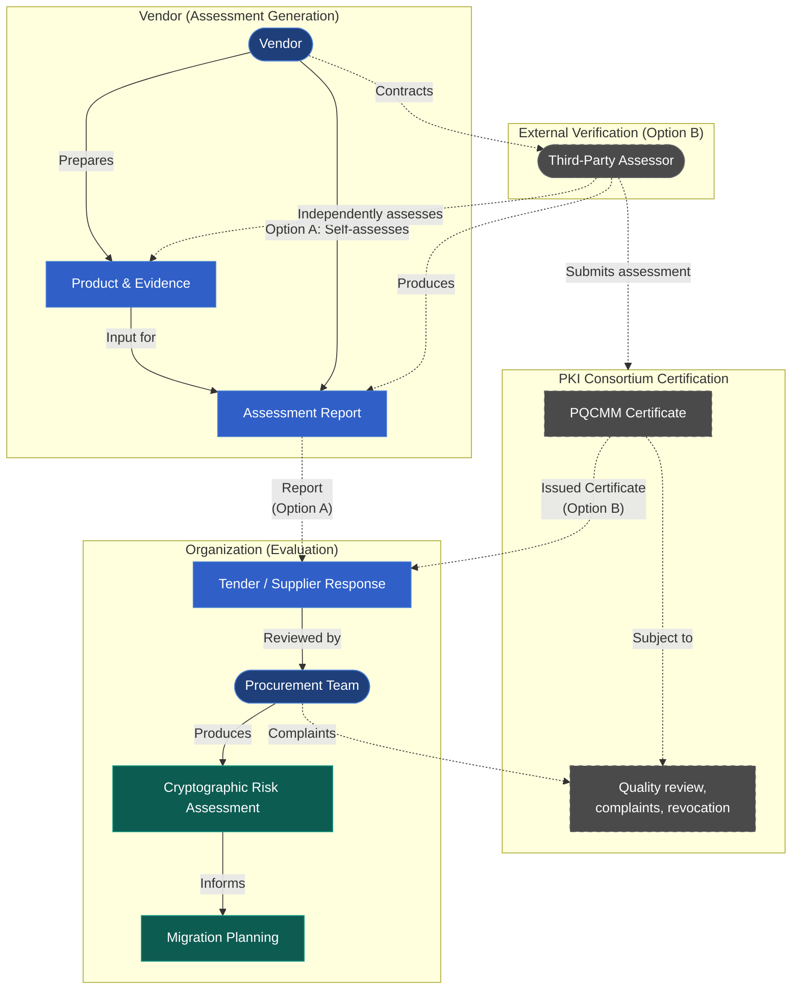

## Overview

Terms like *quantum-ready* and *quantum-safe* are widely used, but their meaning varies from vendor to vendor. The **Post-Quantum Cryptography Maturity Model (PQCMM)** addresses this ambiguity by providing a clear, structured framework that defines what PQC maturity looks like across **all products and services that rely on cryptography**.

The model serves two primary audiences:

- [**Organizations:**](/wg/pqc/pqcmm/adoption/) Evaluate PQC readiness of your existing supply chain and guide procurement.
- [**Vendors:**](/wg/pqc/pqcmm/assessment/) Assess your products and transparently communicate your progress to customers.

> Becoming quantum-ready or quantum-safe is not simply performing a one-time migration; we are transitioning to a state of **Cryptographic Agility** and **Cryptographic Resilience**. 
>
> This isn't a project with a finish line, but the operationalization of a **Modern Cryptographic Lifecycle** that ensures security remains resilient against both current and future threats.
{.callout-info}

*The PQCMM is currently at **Version **. As an active, living standard, it is continuously shaped by community feedback. You can [join the discussion](/discussions) to share your thoughts, or simply select any text and click **Edit** to propose changes to the model or its documentation.*

## Choosing Your Path

Whether you are building products or buying them, the PQCMM provides the framework you need.

### Adopting the Model
You rely on software, hardware, and services that use cryptography. The PQCMM helps you inventory your supply chain, evaluate existing contracts, and set procurement requirements.

[**Get started with the Organization Toolkit →**](/wg/pqc/pqcmm/adoption/)

### Assessing a Product
You build products or provide services that use cryptography. The PQCMM helps you assess your offerings against a standardized scale and prove your maturity to buyers.

[**Get started with Vendor Assessment →**](/wg/pqc/pqcmm/assessment/)

## Scope

The PQCMM is explicitly **product and service-centric** — it evaluates the PQC capabilities of a specific product or service offering, rather than the organization that produces or operates it.

**In scope:** Any product or service, such as but not limited to, hardware, software, cloud services, and enterprise platforms, including the underlying platforms they are built on or depend on. The assessment covers **the product or service as named, released, and shipped** — all of its cryptographic functionality. Vendors cannot exclude parts of the product from the assessment; if a feature is part of the product, it is part of the assessment.

**Out of scope:** Internal services used by the vendor that do not form part of the product offering, such as HR, ERP, CRM, email, and document processing systems. It also excludes the assessment of an organization's internal public key infrastructure operations or governance, which is covered by the [PKI Maturity Model](/wg/pkimm/model/).

This explicit focus makes it a powerful supply-chain tool: procurement teams, integrators, and auditors can use the model to compare vendor offerings on a consistent scale, independent of any single organization's internal security posture.

### Naming the Product or Service

The scope of any PQCMM assessment is defined by a clear, unambiguous description of the product or service being evaluated. A vendor selling multiple products assesses each separately; a vendor with materially different editions or deployment modes (e.g., cloud vs. on-premises) should describe these in the assessment report so buyers can compare like-for-like. The aim is simplicity for procurement: ask for the report covering the product you intend to buy.

### Relationship with Other Standards and Frameworks

The PQCMM focuses specifically on post-quantum readiness at the product or service level. It is intended to complement — not replace — broader standards and certifications. The following are commonly referenced but address different concerns:

| Framework | Focus | Overlap with PQCMM |
|---|---|---|
| NIST FIPS 203/204/205 | Specifications for ML-KEM, ML-DSA, SLH-DSA | The PQCMM references these as the standards a quantum-safe implementation should conform to. |
| NIST FIPS 140-3 | Validation of cryptographic modules | Useful evidence for higher PQCMM levels, but a FIPS 140 certificate does not by itself imply PQC support. |
| ISO/IEC 27001 | Organisational information-security management | Organisation-level scope; the PQCMM is product-level and complementary. |
| SOC 2 | Service organisation controls | Service-level controls; does not assess specific cryptographic algorithms or PQC readiness. |
| EU Cyber Resilience Act | Vulnerability handling and product cybersecurity in the EU | Regulatory; PQCMM evidence may inform CRA compliance but does not satisfy it. |
| NIST SP 800-series PQC migration guidance | Migration planning for organisations | Organisation-level migration; the PQCMM provides the product-level signal those plans rely on. |

A product holding any of the above does **not** automatically meet any PQCMM level. Vendors should reference relevant certifications as supporting evidence within a PQCMM assessment, not as a substitute for it.

### How the PQCMM Differs from the PKI Maturity Model

| | PQCMM | PKI Maturity Model |
|---|---|---|
| **Focus** | Product / service | Organization / PKI operation |
| **Audience** | Vendors, procurement teams | PKI operators, auditors |
| **Question answered** | Is this product quantum-ready? | Is our organization's PKI mature? |
| **Scope** | Any product using cryptography | Organizations running PKI |
| **Coverage** | PQC specifically | Full PKI maturity (all domains) |

The PKI Maturity Model includes a post-quantum cryptography category within its broader assessment framework; the PQCMM is a standalone model solely focused on post-quantum readiness at the product level.

## Design Principles

The PQCMM is intentionally written to remain useful as the cryptographic and standards landscape evolves. The following principles govern how its criteria are phrased:

- **Algorithm- and parameter-neutral criteria.** The model's normative criteria require *capabilities and behaviours* — such as production availability, standards conformance, inventory completeness, crypto agility, and zero-legacy capability — rather than a fixed list of algorithms or parameter sets. Specific algorithms (for example ML-KEM, ML-DSA, SLH-DSA) appear in *Assessment guidance* as illustrative examples of what acceptable evidence looks like, not as hard-coded requirements. This avoids the maturity model becoming obsolete as standards mature or are superseded.
- **Delegation to recognised standards bodies.** Where conformance with a published standard is required, the criterion names the *body* (NIST, ETSI, ISO/IEC, IETF, or an equivalent national authority) rather than the *document*, leaving the choice of currently-applicable specification to the standards body and to the product's target market.
- **Scheme references over scheme versions.** External schemes used in the model (for example Common Platform Enumeration, Package URL, SPDX, CycloneDX) are referenced by name. The currently published version of each scheme applies; adoption of a future revision does not invalidate the model.
- **Crypto agility as the primary control.** Because specific algorithm choices will change, the model treats the ability to *update* algorithms (Levels 3–5) as more important than the choice of any single algorithm at a point in time.

Vendors and assessors should read the criteria as *what* must be achieved and the assessment guidance as *how* it is typically demonstrated today.

## Maturity Levels

The model defines **six levels (0–5)**. Level 0 represents a state where no post-quantum capabilities are available in the product. Levels 1 through 5 are cumulative — a product claiming Level 3 must satisfy all requirements of Levels 1 and 2 as well.


levels:
  - number: 0
    label: None
    color: none
    summary: "No PQC implemented"
    url: "/wg/pqc/pqcmm/levels/0-none/"
  - number: 1
    label: Initial
    color: gray
    summary: "Available for testing & evaluation"
    url: "/wg/pqc/pqcmm/levels/1-initial/"
  - number: 2
    label: Basic
    color: green
    summary: "Production-ready, standards-compliant"
    url: "/wg/pqc/pqcmm/levels/2-basic/"
  - number: 3
    label: Advanced
    color: blue
    summary: "Inventory + SBOM + Crypto Agility"
    url: "/wg/pqc/pqcmm/levels/3-advanced/"
  - number: 4
    label: Managed
    color: violet
    summary: "CBOM + Zero-Legacy + Hybrid support"
    url: "/wg/pqc/pqcmm/levels/4-managed/"
  - number: 5
    label: Optimized
    color: purple
    summary: "PQC default + Benchmarked + Certified"
    url: "/wg/pqc/pqcmm/levels/5-optimized/"


[View detailed criteria, assessment questions, and evidence requirements for each level →](/wg/pqc/pqcmm/levels/)

## The Assessment Process

Understanding the workflow from product development to procurement evaluation helps clarify the responsibilities of vendors, third-party assessors, and purchasing organizations.

## Get Involved

The PQCMM is an open, collaborative initiative. We welcome input on the level definitions, criteria clarity, and anything that may be missing. 

To ensure consistency, the PKI Consortium aims to collaborate with certification bodies so that formal certification reflects the model's intent rather than allowing fragmented interpretations to emerge in isolation.

- **Check terminology:** [PQCMM Glossary](/wg/pqc/pqcmm/glossary/)
- **Read common questions:** [PQCMM FAQ](/wg/pqc/pqcmm/faq/)
- **Follow updates:** [PQC Maturity Model announcement](/blog/2025/10/defining-quantum-readiness-introducing-the-post-quantum-cryptography-maturity-model/)
- **Discuss and comment:** [Join the discussion](https://pkic.org/discussions)
