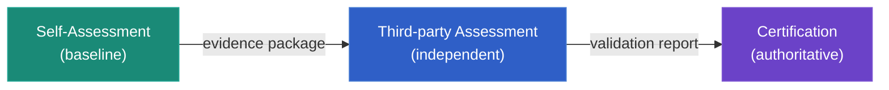

## Maturity Levels

The PQCMM defines **six maturity levels** (0–5) for post-quantum cryptography adoption in products and services. Each level builds on the previous one, defining what PQC readiness means in practice — from the complete absence of any quantum-safe activity, all the way to a fully optimised, PQC-by-default product or service.


levels:
  - number: 0
    label: None
    color: none
    summary: "No PQC implemented"
    url: "/wg/pqc/pqcmm/levels/0-none/"
  - number: 1
    label: Initial
    color: gray
    summary: "Available for testing & evaluation"
    url: "/wg/pqc/pqcmm/levels/1-initial/"
  - number: 2
    label: Foundational
    color: green
    summary: "Production-ready, standards-compliant"
    url: "/wg/pqc/pqcmm/levels/2-foundational/"
  - number: 3
    label: Advanced
    color: blue
    summary: "Inventory + SBOM + Crypto Agility"
    url: "/wg/pqc/pqcmm/levels/3-advanced/"
  - number: 4
    label: Managed
    color: violet
    summary: "CBOM + Zero-Legacy + Hybrid support"
    url: "/wg/pqc/pqcmm/levels/4-managed/"
  - number: 5
    label: Optimized
    color: purple
    summary: "PQC default + Benchmarked + Certified"
    url: "/wg/pqc/pqcmm/levels/5-optimized/"


| Level | Name | Summary |
|---|---|---|
| [0 — None](/wg/pqc/pqcmm/levels/0-none/) | No PQC implemented | PQC might be in the preparation phase, but no quantum-safe algorithms have matured into the product. |
| [1 — Initial](/wg/pqc/pqcmm/levels/1-initial/) | Available for testing | PQC algorithms are available but for testing and evaluation only; not production-ready. |
| [2 — Foundational](/wg/pqc/pqcmm/levels/2-foundational/) | Production-ready | At least one quantum-safe algorithm is available in production and meets relevant standards. |
| [3 — Advanced](/wg/pqc/pqcmm/levels/3-advanced/) | Inventory & Agility | Cryptographic inventory (SBOM/CBOM) is in place, and the product supports crypto agility. |
| [4 — Managed](/wg/pqc/pqcmm/levels/4-managed/) | Zero-Legacy | Legacy algorithms are eliminated or isolated; hybrid support is available. |
| [5 — Optimized](/wg/pqc/pqcmm/levels/5-optimized/) | PQC-by-default | Quantum-safe is the default; performance is benchmarked and the implementation independently verified. |

Select a level to view its detailed criteria, assessment questions, and evidence requirements.

## Cumulative Requirements

Levels are **cumulative** — a product at Level 3 must satisfy every requirement from Levels 1 and 2 as well. Only Level 0 has no positive requirements; it simply describes a state where no post-quantum capabilities are available in the product.

```mermaid
flowchart LR
    classDef l0 fill:#6b7280,stroke:#9ca3af,color:#fff
    classDef l1 fill:#4b5563,stroke:#9ca3af,color:#fff
    classDef l2 fill:#1a8a77,stroke:#22a896,color:#fff
    classDef l3 fill:#2f5fc7,stroke:#4a7fd4,color:#fff
    classDef l4 fill:#6b42c8,stroke:#7f58d4,color:#fff
    classDef l5 fill:#7b35a0,stroke:#9645b8,color:#fff

    L0["0 — None
No PQC implemented"]:::l0
    L1["1 — Initial
Testing available"]:::l1
    L2["2 — Foundational
Production-ready"]:::l2
    L3["3 — Advanced
SBOM + Agility"]:::l3
    L4["4 — Managed
CBOM + Zero-Legacy"]:::l4
    L5["5 — Optimized
PQC by default"]:::l5

    L0 --> L1 --> L2 --> L3 --> L4 --> L5
```

## Assessment & Certification

The PQCMM supports three assurance routes. Buyers can start with self-assessment for visibility, require third-party assessment for higher confidence, or require PKI Consortium certification where authoritative assurance is needed.

**Self-Assessment** — Vendors evaluate their own product against each level's criteria and provide supporting evidence (release notes, software bills of materials, cryptographic bills of materials, test results) alongside the declared level.

**Third-party Assessment** — An independent assessor reviews the vendor's evidence, reproduces key claims, and issues a validation report. This stage raises confidence for high-assurance procurement.

**Certification** — A formal recognition issued by the PKI Consortium based on a qualifying third-party assessment report. The PKI Consortium reviews the report for completeness, methodology adherence, evidence sufficiency, and assessor independence. Certification confirms that a qualifying assessment was reviewed and accepted; it is not a re-assessment of the product and is not a guarantee of security.
